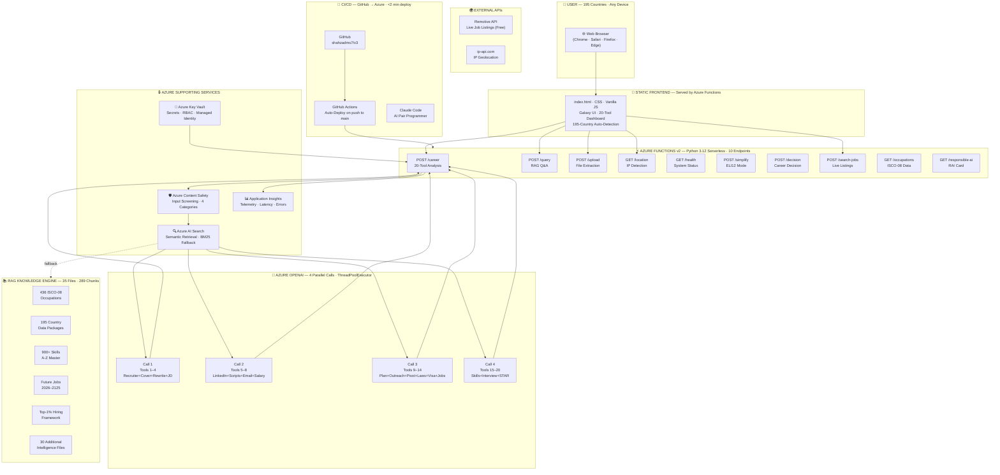
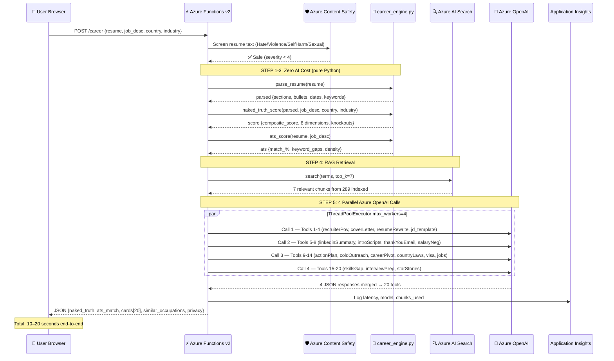
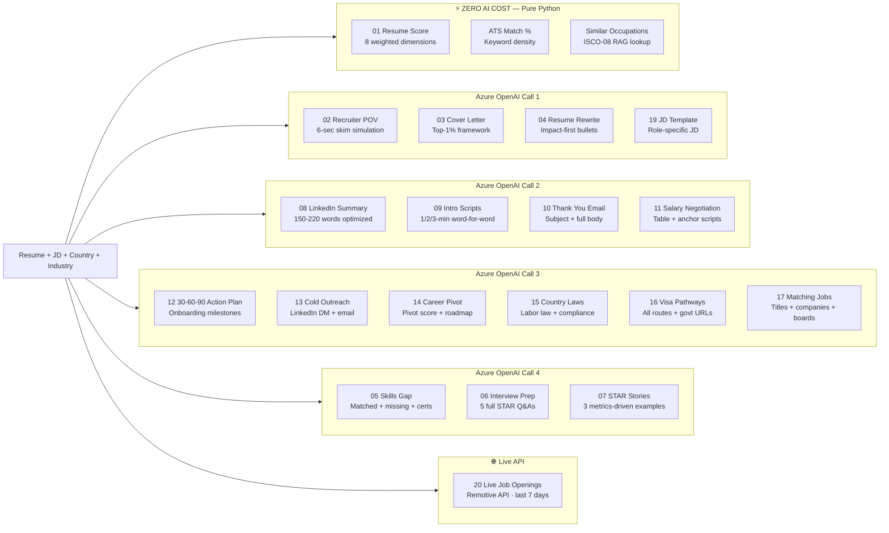
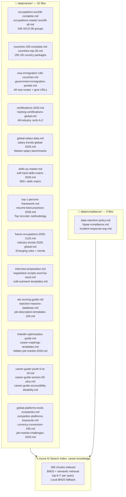
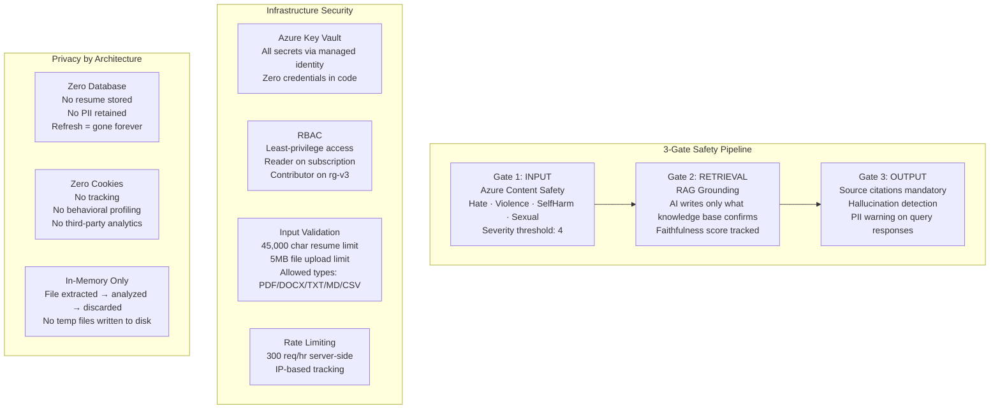

# Alfalah AI — Career Intelligence Platform · System Architecture
### *End-to-End Technical Architecture · 100% Microsoft Azure · Built for 8 Billion People*

<div align="center">


</div>

---

## High-Level System Overview



---

## Request Processing Flow — POST /career (Main Endpoint)



---

## Azure Services — Complete Integration Map

| Azure Service | Tier | Region | Role in Platform | API Version |
|---|---|---|---|---|
| **Azure Functions v2** | Consumption (serverless) | East US | All 10 API endpoints · Python 3.12 · auto-scale | v2 decorator |
| **Azure OpenAI** | gpt-4o-mini | East US | 4 parallel AI calls per analysis · 8192 max tokens | 2024-08-01-preview |
| **Azure AI Search** | Standard S1 | East US | Semantic retrieval · 289 RAG chunks indexed · BM25 fallback | 2024-07-01 |
| **Azure Content Safety** | Standard v1.0 | East US | Input screening before every AI call · 4 categories · severity 4 threshold | 2024-09-01 |
| **Application Insights** | Pay-per-use | East US | Latency tracking · error alerts · chunk telemetry | v2 |
| **Azure Key Vault** | Standard | East US | All secrets · azure-identity managed identity · zero credentials in code | 2023-07-01 |
| **Azure Monitor** | Integrated | East US | Real-time alerts · dashboard · SLA tracking | — |

**Resource Group:** `rg-v3` · **Subscription:** Microsoft Hackathon `2d7fae20-e207-40a5-bc46-53df96affcb7`

---

## 20 Career Intelligence Tools — Execution Map



---

## RAG Knowledge Engine — 35 Files · 289 Chunks



**Data Standards:** ILO ISCO-08 · European Commission ESCO v1.2 · US O*NET · Statistics Canada NOC 2021

---

## Security Architecture



---

## CI/CD Pipeline

```
Push to main (GitHub)
        │
        ▼
GitHub Actions (ubuntu-latest)
        ├── actions/checkout@v4
        ├── actions/setup-python@v5 (Python 3.12)
        ├── pip install -r requirements.txt --target=.python_packages/lib/site-packages
        ├── Azure/functions-action@v1
        │     app-name: govrag-v3-func
        │     publish-profile: ${{ secrets.AZURE_FUNCTIONAPP_PUBLISH_PROFILE }}
        │     scm-do-build-during-deployment: true
        │     enable-oryx-build: true
        └── Health check: GET /api/health (30s warm-up)

Deploy time: ~2 minutes · Zero downtime · Serverless swap
```

---

## Performance Targets

| Metric | Target | Actual (observed) |
|--------|--------|-------------------|
| End-to-end analysis | < 15 seconds | 10–20 seconds |
| Content Safety check | < 500ms | ~200ms |
| RAG retrieval (Azure AI Search) | < 200ms | ~150ms |
| Single Azure OpenAI call | < 8 seconds | 5–12 seconds |
| File upload + extraction | < 2 seconds | < 1 second |
| Cold start (serverless) | < 3 seconds | ~2 seconds |
| Platform uptime | 99.9% (Azure SLA) | Azure guaranteed |

---

## Repository Structure

```
shahzadms7/v3/
├── function_app.py              # Azure Functions v2 — all 10 endpoints (887 lines)
├── host.json                    # routePrefix: "" · Extension Bundle 4.*
├── requirements.txt             # Python dependencies (lean — no heavy ML)
├── web.config                   # Azure routing rules
│
├── app/core/
│   ├── career_engine.py         # Resume parser + ATS scorer (zero AI cost)
│   ├── decision_engine.py       # Full career decision algorithm
│   ├── ai_provider.py           # Azure OpenAI async client
│   ├── rag_engine.py            # Local BM25 search fallback
│   ├── safety_engine.py         # Azure Content Safety wrapper
│   ├── azure_ai_services.py     # PII detection, key phrases, translation
│   ├── audit_logger.py          # Application Insights telemetry
│   └── config.py                # pydantic-settings from env vars
│
├── data/
│   ├── career/                  # 32 Markdown knowledge files
│   └── compliance/              # 3 compliance reference files
│
├── static/
│   └── index.html               # Single-page frontend (HTML/CSS/Vanilla JS)
│
├── docs/
│   ├── RESPONSIBLE_AI_IMPACT_ASSESSMENT.md
│   ├── TRANSPARENCY_NOTE.md
│   └── screenshots/             # Platform screenshots
│
└── .github/workflows/
    └── main_govrag-v3.yml       # CI/CD: GitHub → Azure Functions
```

---

<div align="center">

*Alfalah AI · 100% Microsoft Azure · East US · rg-v3*

**[Live Platform](https://govrag-v3-func.azurewebsites.net) · [API Health](https://govrag-v3-func.azurewebsites.net/api/health) · [GitHub](https://github.com/shahzadms7/v3)**

</div>
