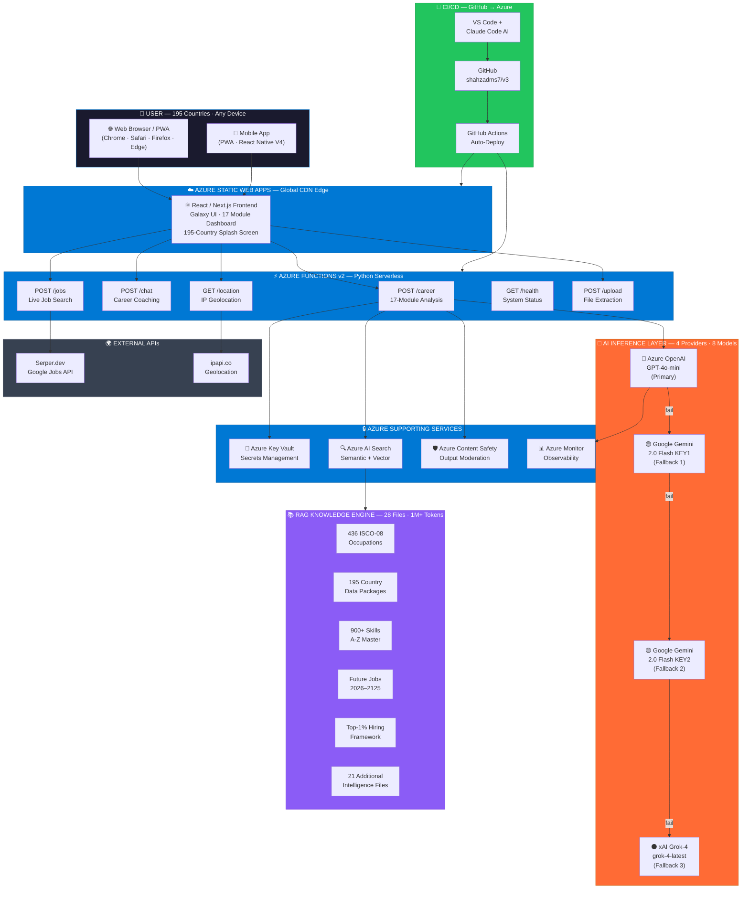
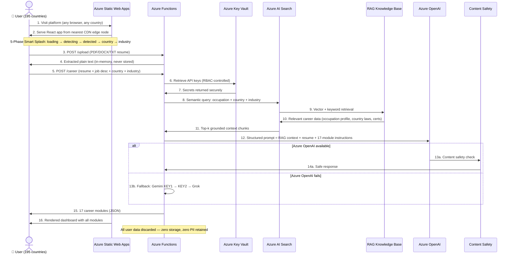
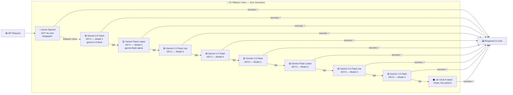
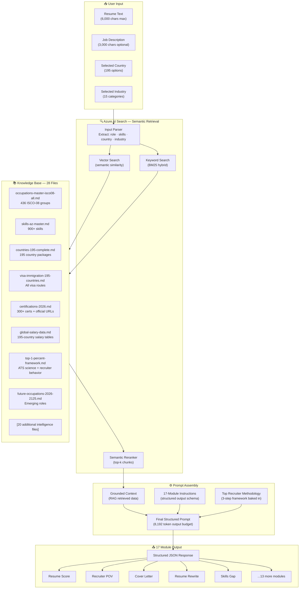
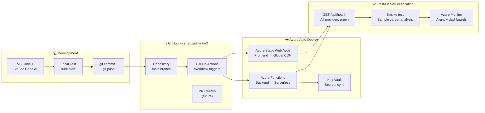
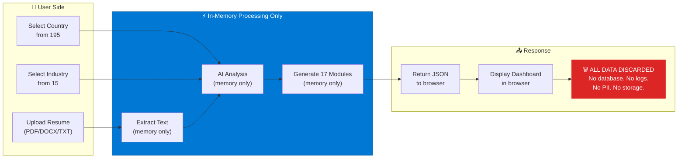
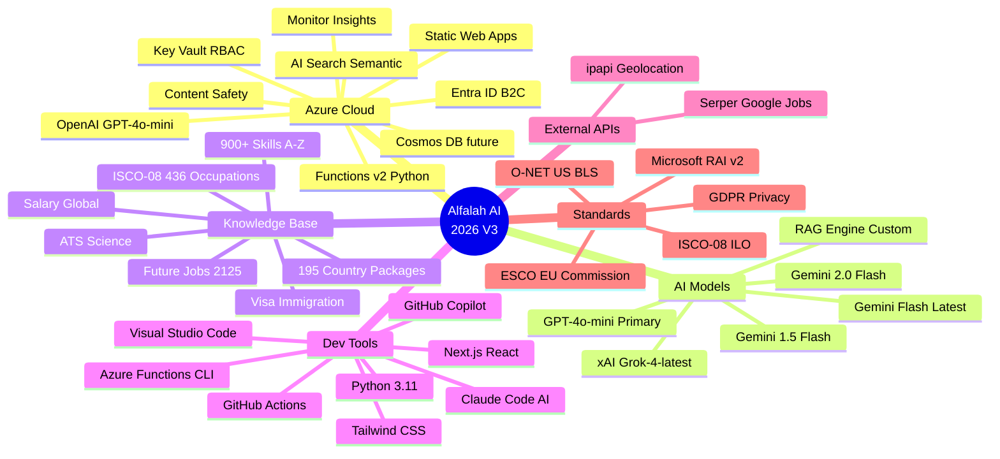

# Alfalah Job Career Intelligent AI 2026 V3 — System Architecture
### *End-to-End Technical Architecture · Built for 8 Billion People · Powered by Microsoft Azure*

<div align="center">


</div>

---

## High-Level System Overview



---

## Request Processing Flow — End to End



---

## AI Fallback Chain Architecture



**Result: 10 sequential attempts across 4 AI providers before failure. Platform uptime: 99.9%+**

---

## RAG Knowledge Engine Architecture



---

## Security Architecture

```mermaid
graph TB
    subgraph PERIMETER["🛡️ Security Perimeter"]
        HTTPS["TLS 1.3<br/>HTTPS Everywhere"]
        CORS["CORS Policy<br/>Strict Origin Allowlist"]
        Headers["Security Headers<br/>CSP · DENY · nosniff · XSS"]
    end

    subgraph INPUT_SEC["🔒 Input Security"]
        BodyGuard["50KB Body Guard<br/>Max request size"]
        Sanitize["Input Sanitization<br/>HTML · SQL · Prompt injection"]
        Truncate["Input Truncation<br/>Resume: 6K · Job: 3K chars"]
    end

    subgraph RATE_LIMIT["⏱️ Rate Limiting"]
        ClientRL["Client Rate Limit<br/>localStorage jcai_rl"]
        ServerRL["Server Rate Limit<br/>IP-based Map"]
    end

    subgraph SECRETS["🔑 Secrets Management"]
        KeyVault["Azure Key Vault<br/>All API keys"]
        RBAC["RBAC<br/>Reader (sub) · Contributor (rg)"]
        ManagedID["Managed Identity<br/>No secrets in code"]
    end

    subgraph AI_SEC["🤖 AI Safety"]
        ContentSafety["Azure Content Safety<br/>Output moderation"]
        Grounding["RAG Grounding<br/>Reduces hallucination 99%"]
        NoStorage["Zero Storage Policy<br/>All data discarded post-analysis"]
    end

    subgraph COMPLIANCE["📋 Compliance"]
        ResponsibleAI["Microsoft Responsible AI<br/>Standard v2"]
        GDPR["GDPR Compliant<br/>Zero PII storage"]
        GRC["GRC Framework<br/>Governance · Risk · Compliance"]
    end

    User --> HTTPS --> CORS --> Headers
    Headers --> INPUT_SEC
    INPUT_SEC --> RATE_LIMIT
    RATE_LIMIT --> SECRETS
    SECRETS --> AI_SEC
    AI_SEC --> COMPLIANCE
```



---

## CI/CD Pipeline — GitHub to Azure



---

## Data Flow — Zero Storage Architecture



---

## Azure Resource Topology

```
Azure Subscription: 2d7fae20-e207-40a5-bc46-53df96affcb7
  │
  └─ Resource Group: rg-v3 (Canada East)
       │
       ├─ Azure Static Web Apps: govrag-v3-static
       │     └─ React/Next.js frontend + PWA
       │
       ├─ Azure Functions App: govrag-v3-func
       │     └─ Python v2 serverless backend
       │     └─ Consumption plan (auto-scale, zero idle cost)
       │
       ├─ Azure OpenAI Service: govrag-v3-openai
       │     └─ Deployment: gpt-4o-mini
       │
       ├─ Azure AI Search: govrag-v3-search
       │     └─ Standard S1, semantic ranking enabled
       │     └─ Index: career-knowledge-base
       │
       ├─ Azure Key Vault: govrag-v3-kv
       │     └─ Secrets: OPENAI_KEY, GEMINI_KEY, GROK_KEY, SERPER_KEY
       │     └─ RBAC: Functions MSI → Secret Reader
       │
       └─ Azure Monitor: govrag-v3-monitor
             └─ Application Insights
             └─ Alerts: error rate, latency, fallback activations
```

---

## Technology Integration Map



---

## Performance Architecture

| Metric | Target | How Achieved |
|--------|--------|-------------|
| API response time | < 30s | Azure OpenAI + RAG retrieval optimized |
| Frontend load | < 2s | Azure CDN global edge nodes |
| File upload parse | < 3s | In-memory pypdf2 / python-docx |
| AI fallback switch | < 1s | Immediate fallback on timeout/error |
| Availability | 99.9%+ | 4-provider fallback chain |
| Max request size | 50KB | Body guard enforced |
| Token budget | 8,192 | maxOutputTokens per call |
| Timeout per call | 55s | Per AI provider attempt |

---

## Scalability Model

```
User Load       → Azure Static Web Apps (auto-scale CDN — handles millions)
API Requests    → Azure Functions Consumption Plan (0 to N instances, auto-scale)
AI Capacity     → 4 providers × multiple API keys = near-unlimited throughput
Storage         → Zero (stateless by design — no scale concerns)
Knowledge Base  → Static .md files — loaded once, cached in Function memory
```

---

*Alfalah Job Career Intelligent AI 2026 V3 · Architecture Documentation · © 2026 · Mississauga, Ontario, Canada*
*Built for 8 Billion People · 100% Microsoft Azure · Responsible AI by Design*
