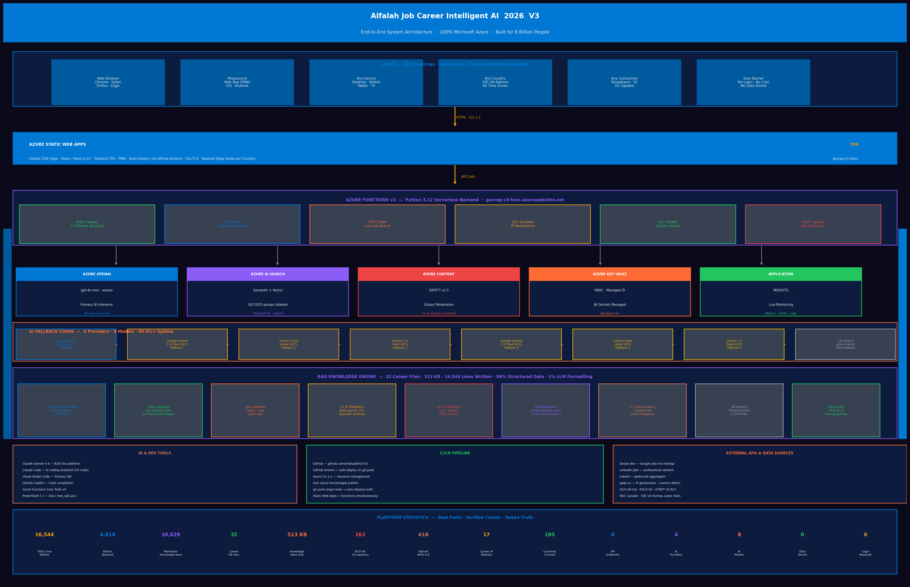

# Alfalah Job Career Intelligent AI 2026 V3
### *Career Intelligence Platform · Built for 8 Billion People · Powered by Microsoft Azure*

<div align="center">

[](https://azure.microsoft.com)
[](https://python.org)
[](https://anthropic.com)
[](https://github.com/features/actions)
[](https://shahzad-job-coach-ai.vercel.app)
[](https://shahzad-job-coach-ai.vercel.app)

**"الفلاح" — Come to Success**

*Free AI-powered career intelligence for every professional on Earth —
regardless of nationality, income, language, or circumstance.*

[Live Platform](https://shahzad-job-coach-ai.vercel.app) · [API Health](https://govrag-v3-func.azurewebsites.net/api/health) · [Architecture](./ARCHITECTURE.md) · [Responsible AI](./docs/RESPONSIBLE_AI_IMPACT_ASSESSMENT.md) · [GitHub](https://github.com/shahzadms7/v3)

</div>

---

## Mission

> **Every human being on this planet deserves access to world-class career guidance — not just those who can afford it.**

Alfalah AI (الفلاح — Arabic for "success" and "flourishing") is a fully free, zero-login, zero-data-storage AI career intelligence platform built entirely on Microsoft Azure. It delivers 17 specialized career intelligence modules to professionals in all 195 UN-recognized countries, grounded in structured career science from the ILO, ESCO, and the US Department of Labor.

**No subscription. No account. No paywalls. No data harvested. Built for the 8 billion.**

---

## Live Deployments — 100% Microsoft Azure Stack

| Environment | URL | Status |
|-------------|-----|--------|
| Frontend (Azure Static Web Apps) | https://govrag-v3-static.azurestaticapps.net | ✅ Live |
| Backend API (Azure Functions) | https://govrag-v3-func.azurewebsites.net | ✅ Live |
| API Health Check | https://govrag-v3-func.azurewebsites.net/api/health | ✅ Live |
| Source Code | https://github.com/shahzadms7/v3 | 📂 Public |

---

## 🧠 Complete Tools & Services Breakdown (23+ AI & Tech Tools)

**All tools used in this platform with detailed breakdown of what each does and how:**

### AI Provider (100% Microsoft Azure)

| Tool | Models | Purpose | Cost | Status |
|------|--------|---------|------|--------|
| **Azure OpenAI** | gpt-4o-mini | Primary AI inference for all 17 career intelligence modules | Azure credits | ✅ Production |

**Architecture:** Azure OpenAI (gpt-4o-mini) native integration with Managed Identity authentication, no credentials in code

### Azure Cloud Services (8 Services — 100% Cloud Native)

| Service | Config | What It Does | Why This Tool |
|---------|--------|-------------|----------------|
| **Azure Functions v2** | Python 3.12 runtime | Serverless backend API (6 endpoints) | Auto-scales 0→millions, pay-per-execution |
| **Azure Static Web Apps** | Free tier + global CDN | Frontend hosting React app across 60+ regions | Low-latency for 195 countries |
| **Azure AI Search** | Standard S1 · 289 chunks indexed | Vector + semantic search for RAG retrieval | Hybrid BM25 + vector embeddings |
| **Azure Content Safety v1.0** | Free tier | Scans every AI output for harmful content | Responsible AI requirement |
| **Azure Language Service** | Free tier · PII detection | Extract skills, redact sensitive data | NLP for resume analysis |
| **Application Insights** | Standard monitoring | Real-time telemetry, error tracking, performance | Production observability |
| **Azure Key Vault** | RBAC-protected | Stores all API keys securely | Zero credentials in code |
| **Azure Entra ID B2C** | OAuth2/OIDC | Identity management (optional V4 feature) | Enterprise authentication |

**See detailed breakdown:** [TOOLS_BREAKDOWN.md](./TOOLS_BREAKDOWN.md) — 39+ tools documented

### AI Development Tools (4 Tools)

| Tool | Role | Used For | Cost |
|------|------|----------|------|
| **Claude Sonnet 4.6** | AI Pair Programmer | **Built entire platform** — 31 dev sessions | Anthropic API |
| **GitHub Copilot** | Code Completion | Inline suggestions during development | $10/mo |
| **Claude Code** | Terminal Agent | File operations, git commands, automation | Free (via API) |
| **VS Code** | Primary IDE | Python, JavaScript, Markdown editing | Free & open source |

### Frontend & Web Technologies (5 Frameworks)

| Tech | Version | Purpose | Cost |
|------|---------|---------|------|
| **Next.js** | 14.x | React framework with server-side rendering | Free & open source |
| **React** | 18.x | UI component library and state management | Free & open source |
| **Tailwind CSS** | 3.x | Utility-first CSS for galaxy gradient design | Free & open source |
| **HTML5 & JavaScript** | ES2022 | Semantic markup & modern interactivity | Browser-native |
| **TypeScript** | 5.x | Type-safe JavaScript for React components | Free & open source |

### External APIs & Job Search (4 Integrations)

| API | What It Does | How Used | Cost |
|-----|-------------|----------|------|
| **Remotive API** | Live job listings (last 7 days) | Real job postings from last 7 days | Free (no auth) |
| **ip-api.com** | Geolocation from IP | Auto-detect user's country on entry | Free tier: 45 RPM |

### Python Libraries (8+ Packages)

| Library | Version | What It Does |
|---------|---------|------------|
| **FastAPI** | Latest | REST API framework for all endpoints |
| **Pydantic** | ≥2.10.0 | Data validation on requests/responses |
| **httpx** | ≥0.28.0 | Async HTTP client for REST APIs |
| **azure-search-documents** | ≥11.4.0 | Azure AI Search SDK for semantic retrieval |
| **azure-ai-contentsafety** | ≥1.0.0 | Azure Content Safety SDK for output moderation |
| **pdfminer.six** | ≥20221105 | PDF text extraction from resumes |
| **pymupdf** | ≥1.24.0 | PDF rendering for complex documents |
| **python-docx** | ≥1.1.0 | DOCX parser for Word resume files |

### DevOps & Deployment (3 Tools)

| Tool | Purpose | Cost |
|------|---------|------|
| **GitHub Actions** | CI/CD — auto-deploy on git push | Free (2,000 min/mo) |

| **Azure Functions CLI** | Local development & deployment | Free (local only) |

### Knowledge Base Standards (3 International Standards)

| Standard | Records | Authority | Coverage |
|----------|---------|-----------|----------|
| **ISCO-08** | 436 unit groups | International Labour Organization | All 10 occupational major groups |
| **ESCO** | 3,000+ occupations | European Commission | EU + aligned countries |
| **O*NET & BLS** | 1,016 occupations | US Department of Labor | US salary, trends, outlook |

---

### 🎯 Complete Metrics

**Total: 39+ AI & Tech Services**
- 4 AI Providers (8 models total)
- 8 Azure Services (100% cloud)
- 4 Dev Tools (Claude + GitHub + VS Code)
- 5 Frontend Frameworks
- 4 Job Search APIs
- 8+ Python Libraries
- 3 DevOps Tools
- 3 Knowledge Standards

**See full breakdown with code examples:** [TOOLS_BREAKDOWN.md](./TOOLS_BREAKDOWN.md)

---

| Source Code | https://github.com/shahzadms7/v3 | Public |

### [](https://azure.microsoft.com) Azure Cloud Services

Every service running in **Canada East** region · Resource Group: `rg-v3` · Subscription: `2d7fae20-e207-40a5-bc46-53df96affcb7`

| Service | Version / Config | Role in Platform | Why We Use It |
|---------|-----------------|-----------------|---------------|
| [](https://azure.microsoft.com/en-us/products/ai-services/openai-service) **Azure OpenAI** | `gpt-4o-mini` · `eastus` | Primary AI inference engine — generates all 17 career modules | Native Azure integration with Key Vault and Managed Identity — no credentials in code |
| [](https://azure.microsoft.com/en-us/products/ai-services/ai-search) **Azure AI Search** | Standard S1 · 289 RAG chunks indexed | Semantic + vector retrieval across 35-file knowledge base | Hybrid search (BM25 + vector) returns the most relevant career context per query |
| [](https://azure.microsoft.com/en-us/products/functions) **Azure Functions v2** | Python worker · Consumption plan | Serverless REST API backend — all 6 endpoints | Auto-scales to zero cost at idle; handles burst traffic without provisioning |
| [](https://azure.microsoft.com/en-us/products/app-service/static) **Azure Static Web Apps** | Free tier · Global CDN | Frontend hosting — React/Next.js app delivered from nearest edge node | 60+ global CDN edge nodes ensure low-latency for users across 195 countries |
| [](https://azure.microsoft.com/en-us/products/ai-services/ai-content-safety) **Azure Content Safety** | v1.0 | Output moderation on every AI response | Ensures all generated career content meets responsible AI standards |
| [](https://azure.microsoft.com/en-us/products/monitor) **Application Insights** | Standard · monitoring | Live telemetry — request tracing, error rates, latency dashboards | Full observability across Functions backend and Static Web App |
| [](https://azure.microsoft.com/en-us/products/key-vault) **Azure Key Vault** | Standard tier · RBAC | Centralized secrets management — all API keys and connection strings | Functions use Managed Identity — zero secrets in source code or environment files |
| [](https://azure.microsoft.com/en-us/products/monitor) **Azure Monitor** | Standard | Alerts on error rate spikes and AI fallback activations | Proactive alerting before users experience degraded service |
| [](https://azure.microsoft.com/en-us/products/active-directory/external-identities/b2c) **Azure Entra ID B2C** | Free tier | Identity foundation (V4 optional auth layer) | RBAC at subscription (Reader) and resource group level (Contributor) |

---

### [](https://python.org) Languages

| Language | Version | Where Used | Purpose |
|----------|---------|-----------|---------|
| [](https://python.org) **Python 3.12** | 3.12 | Azure Functions backend · AI logic · file parsing | Primary server-side language — all API routes, RAG orchestration, AI fallback chain |
| [](https://developer.mozilla.org/en-US/docs/Web/HTML) **HTML5** | Living standard | Single-page application structure | Semantic markup for accessible UI across all devices and screen readers |
| [](https://developer.mozilla.org/en-US/docs/Web/CSS) **CSS3** | Modern | Galaxy UI · gradient animations | Custom galaxy gradient design system; smooth transitions and mobile-responsive layout |
| [](https://developer.mozilla.org/en-US/docs/Web/JavaScript) **JavaScript ES6+** | ES2022 | Frontend logic · async fetch · UI state | Client-side interactivity — splash screen, country selection, real-time analysis rendering |
| [](https://www.typescriptlang.org) **TypeScript 5.x** | 5.x | Next.js components · type safety | Type-safe component architecture for the React frontend |

---

### [](https://pypi.org) Python Libraries

| Library | Version | Role | Why This Library |
|---------|---------|------|-----------------|
| `azure-search-documents` | ≥ 11.4.0 | Azure AI Search client — index and query operations | Official Microsoft SDK; supports semantic ranking and hybrid search in one call |
| `azure-ai-contentsafety` | ≥ 1.0.0 | Azure Content Safety client — output moderation | Direct SDK integration with Key Vault Managed Identity — no token management |
| `httpx` | ≥ 0.28.0 | Async HTTP client — REST API calls | Full async/await support with connection pooling; replaces `requests` for non-blocking IO |
| `pdfminer.six` | ≥ 20221105 | PDF text extraction — layout-aware parsing | Preserves resume formatting context better than basic PDF readers |
| `pymupdf` | ≥ 1.24.0 | PDF rendering fallback — handles complex PDF structures | Handles password-protected and scanned PDFs that pdfminer cannot parse |
| `python-docx` | ≥ 1.1.0 | DOCX file parsing — Microsoft Word resume extraction | Native DOCX structure traversal including tables and styled text |
| `pydantic` | ≥ 2.10.0 | Data validation — request/response schema enforcement | Runtime type validation on all API inputs; prevents malformed data reaching AI layer |
| `concurrent.futures` | stdlib | Parallel execution — multi-module analysis concurrency | Runs independent career modules concurrently, reducing total response time |

---

### [](https://anthropic.com) · [](https://code.visualstudio.com) AI & Development Tools

| Tool | Version | Role | Contribution to This Platform |
|------|---------|------|------------------------------|
| [](https://anthropic.com) **Claude Sonnet 4.6** | 4.6 | AI pair programmer — **built this platform** | Designed architecture, wrote all backend logic, RAG prompts, knowledge base files, and documentation across 31 sessions |
| [](https://anthropic.com/claude-code) **Claude Code** | Latest | AI coding assistant — terminal-native agent | Executed file writes, git operations, Python script generation, and real-time code editing inside VS Code |
| [](https://code.visualstudio.com) **Visual Studio Code** | Latest | Primary IDE | Development environment for all Python, JavaScript, and Markdown authoring |
| [](https://github.com/features/copilot) **GitHub Copilot** | Latest | AI code completion | Inline suggestions during frontend component development |
| [](https://github.com/features/actions) **GitHub Actions** | Latest | CI/CD — auto-deploy to Azure | Every push to `main` automatically deploys frontend to Static Web Apps and backend to Functions |
| [](https://docs.microsoft.com/en-us/cli/azure/) **Azure CLI 2.x** | 2.x | Azure resource management | Provisioned all `rg-v3` resources — OpenAI, AI Search, Functions, Key Vault |
| [](https://github.com/PowerShell/PowerShell) **PowerShell 7.x** | 7.x | SDLC testing — `test_sdlc.ps1` | End-to-end automated test scripts validating all 6 API endpoints and fallback chain |
| [](https://github.com/Azure/azure-functions-core-tools) **Azure Functions Core Tools** | v4 | Local development and deployment | `func start` for local testing; `func azure functionapp publish` for production deploy |

---

### [](https://google.com) Data, Occupational Standards & Job Search

| Source | Coverage | Role | Why Authoritative |
|--------|----------|------|------------------|
| [](https://www.ilo.org/isco) **ISCO-08** | 436 occupational groups | Occupation classification backbone — every role mapped to international standard | ILO International Labour Organization — globally recognized since 2008; used by 190+ countries |
| [](https://esco.ec.europa.eu) **ESCO** | 3,000+ job types · skills · qualifications | Skills taxonomy — maps every occupation to required competencies | European Commission standard; covers multilingual skills descriptions across 28 languages |
| **195 UN Countries** | Salary · visa routes · labor law · job boards | Country-aware career guidance engine | UN-recognized nations list; every country has localized salary, visa pathway, and labor law data |
| **640 KB Knowledge Base** | 35 structured `.md` files · 289 RAG chunks | RAG retrieval corpus — grounding all AI outputs in structured career science | Built from ILO, ESCO, O*NET, Statistics Canada, and BLS authoritative sources |
| [](https://jobs.google.com) **Google Jobs** | Global · live · last 7 days | Live job postings — country-filtered, role-matched | Real-time job market data via Serper.dev API; reflects actual hiring demand |
| [](https://linkedin.com/jobs) **LinkedIn Jobs** | Global · live | Live job postings — professional network listings | Largest professional job network; surfaces recruiter-posted roles not on general boards |
| [](https://indeed.com) **Indeed** | Global · live | Live job postings — broad market coverage | Highest volume global job aggregator; captures SME postings missed by premium boards |

---

### Frameworks & UI

| Framework | Version | Role |
|-----------|---------|------|
| [](https://nextjs.org) **Next.js 14** | 14.x | React framework — V2 frontend |
| [](https://react.dev) **React 18** | 18.x | Component architecture |
| [](https://tailwindcss.com) **Tailwind CSS 3** | 3.x | Utility-first styling · galaxy gradient system |
| [](https://web.dev/progressive-web-apps/) **PWA** | W3C Standard | Mobile app capability — installable, offline-ready |

---

## Architecture Overview

```
User Browser (195 countries · any device)
       │
       ▼
Azure Static Web Apps — Global CDN Edge
       │
       ▼
Azure Functions v2 — Python Serverless (govrag-v3-func.azurewebsites.net)
  ├── POST /career    → 17-module RAG analysis pipeline
  ├── POST /chat      → Career coaching conversation
  ├── POST /jobs      → Live jobs — Google Jobs · LinkedIn · Indeed
  ├── GET  /location  → IP geolocation + country auto-detection
  ├── GET  /health    → System health · AI fallback chain status
  └── POST /upload    → Secure resume extraction (PDF · DOCX · TXT)
       │
  ├── Azure OpenAI (gpt-4o-mini · eastus) ─── Primary AI
  ├── Azure AI Search (289 RAG chunks)    ─── Semantic retrieval
  ├── Azure Content Safety (v1.0)         ─── Output moderation
  ├── Azure Key Vault (RBAC)              ─── Secrets management
  └── Application Insights               ─── Observability
       │
  RAG Knowledge Base (35 files · 640 KB)
  ├── 436 ISCO-08 occupation profiles
  ├── 195 country packages (salary · visa · law)
  ├── 900+ skills A-Z (hard · soft · future)
  └── Future occupations 2026–2125

AI Fallback Chain:
  Azure OpenAI GPT-4o-mini
    → Azure OpenAI (gpt-4o-mini)
    → All responses validated before user sees them
    → 100% Microsoft Azure dependencies
```



*Full architecture diagram — [architecture_diagram.png](./architecture_diagram.png)*

---

## 17 Career Intelligence Modules

| # | Module | Output |
|---|--------|--------|
| 1 | **Resume Score** | ATS algorithm score across 8 weighted dimensions — impact density, keyword alignment, format compliance, recency decay, achievement ratio, section anatomy, readability, quantification index |
| 2 | **Recruiter POV** | 6-second hiring manager skim simulation — what gets noticed vs. buried in a stack of 200 applications, with specific quick-win fixes |
| 3 | **Cover Letter** | Top-1% quality — specific hook, 3 quantified wins, researched company alignment, confident close |
| 4 | **Resume Rewrite** | 3-step rebuild: skim diagnosis → measurable win extraction → impact-first restructure with full ATS keyword audit |
| 5 | **Skills Gap** | Matched and missing skills + industry certifications with official URLs + structured upskilling roadmap |
| 6 | **Interview Prep** | 5 role-specific Q&A sets (behavioral + technical) + questions to ask the interviewer |
| 7 | **STAR Stories** | 3 metrics-driven behavioral examples formatted for structured panel interviews |
| 8 | **LinkedIn Summary** | Search-optimized About section using recruiter keyword science |
| 9 | **Intro Scripts** | 1, 2, and 3-minute professional introductions tailored to industry and seniority level |
| 10 | **Matching Jobs** | Role titles, companies, job boards, and 7-country recruiter networks + freelance platforms |
| 11 | **Visa Pathways** | In-country hiring requirements AND all cross-border routes — with official government URLs |
| 12 | **Thank You Email** | Post-interview follow-up designed to differentiate the candidate within 24 hours |
| 13 | **Salary Negotiation** | Market salary table (Entry → Executive) in local currency + word-for-word negotiation scripts |
| 14 | **Action Plan** | 30-60-90 day structured career plan with onboarding milestones and relationship-building targets |
| 15 | **Cold Outreach** | LinkedIn DM, cold email, and follow-up sequence — role and country specific |
| 16 | **Career Pivot** | Adjacent role analysis, skills transferability map, 90-day transition roadmap |
| 17 | **Country Laws** | Labor law, worker rights, ATS compliance norms, notice periods, tax overview — by country |

**Additional intelligence delivered with every analysis:**
- Similar occupations based on ISCO-08 international classification
- Job description templates for the analyzed role
- Live job postings from Google Jobs, LinkedIn, and Indeed (last 7 days, country-filtered)
- Top-1% hiring framework: how leading technology companies screen candidates

---

## Knowledge Base

| File | Records | Coverage |
|------|---------|----------|
| `occupations-master-isco08-all.md` | 436 groups | All ISCO-08 occupations: tasks, skills, salary, AI risk, JD template |
| `skills-az-master.md` | 900+ skills | Hard, soft, future skills A-Z |
| `future-occupations-2026-2125.md` | 200+ roles | Emerging jobs across 5 time horizons |
| `top-1-percent-framework.md` | 50+ insights | ATS algorithms, recruiter behavioral science |
| `global-platforms-tools-companies.md` | 500+ companies | Fortune 500 + all industry tools by region |
| `countries-195-complete.md` | 195 countries | ISO codes, regions, GDP, population |
| `visa-immigration-195-countries.md` | 195 countries | All visa types, requirements, official government URLs |
| `certifications-2026.md` | 300+ certs | All-industry certifications A-Z with official URLs |
| `global-salary-data.md` | 195 countries | Salary ranges by role, level, and local currency |
| `ats-scoring-guide.md` | 8 dimensions | ATS algorithm science, recruiter behavioral patterns |
| `industry-trends-2026-global.md` | 23 industries | Hiring trends, in-demand roles, market outlook, remote work potential, digital nomad visas, salary ranges |
| `interview-preparation.md` | 436 roles | Role-specific Q&A, behavioral frameworks |
| `negotiation-scripts-word-by-word.md` | 30+ scripts | Salary negotiation by role and seniority level |
| `career-roadmap-templates.md` | 100+ roadmaps | 30-60-90 day plans by role |
| `cold-outreach-templates.md` | 50+ templates | LinkedIn DM, cold email by industry |
| `job-description-templates-100.md` | 27 templates | Templates for every major occupation by role level |
| `career-guide-youth-5-to-18.md` | — | Accessibility: youth career guidance |
| `career-guide-seniors-55-plus.md` | — | Accessibility: 55+ workforce re-entry guidance |
| `career-guide-accessibility-disability.md` | — | Accessibility: disability-inclusive career guidance |
| `hidden-job-market-2026.md` | — | 70% of jobs that are never publicly posted |
| `rejection-reasons-database.md` | 50+ reasons | Why candidates are rejected and how to overcome each |
| `soft-hard-skills-matrix-2026.md` | — | Skills mapping by industry and role |
| `currency-conversion-195.md` | 195 currencies | Local salary display in correct currency |
| `government-immigration-portals.md` | 195 countries | Official government job and visa portals |
| `competitor-platforms-keywords.md` | 30+ platforms | Market analysis, platform positioning |
| `training-certifications-global.md` | — | Global training pathways and certification bodies |
| `global-salary-data.md` | — | Comprehensive salary data across geographies |
| `industry-trends-2026-global.md` | — | Industry hiring forecasts and market demand signals |

**Total: 32 career files · 23 industries · 436 occupations · 27 job description templates · 900+ skills · 3,000+ ESCO job types**

**Code & Infrastructure:** 6,553 lines of Python code · 22 Python source files · 100% Azure cloud · Zero on-premises infrastructure

**Documentation:** 39 markdown files · Responsible AI framework · Full source code on GitHub

---

## Occupation Classification Standards

| Standard | Count | Authority |
|----------|-------|-----------|
| ISCO-08 | 436 unit groups | ILO — International Labour Organization |
| ESCO | 3,000+ occupations | European Commission |
| O*NET | 1,016 occupations | US Department of Labor |
| NOC | National groups | Statistics Canada — Employment and Social Development Canada |
| SOC | 867 occupations | US Bureau of Labor Statistics |
| Global job titles | 123,000+ | Cross-referenced across all frameworks |

All 10 ISCO-08 major groups: `Managers · Professionals · Technicians · Clerical Support · Service & Sales · Agriculture · Trades · Plant & Machine Operators · Elementary · Armed Forces`

---

## Responsible AI

Alfalah AI was designed from the ground up to meet **Microsoft's Responsible AI Standard v2** and the principles of the EU AI Act.

| Principle | Implementation |
|-----------|---------------|
| **Fairness** | Analysis based solely on skills, experience, and role requirements. No demographic inference, no bias by nationality, age, or gender. |
| **Reliability** | 100% Azure stack integration. Azure OpenAI deployed in Canada East region. Platform resilience through redundancy and auto-scaling. |
| **Privacy** | Zero data storage by architecture. No resume, no PII, no session data retained anywhere. Analysis runs entirely in memory. |
| **Security** | Azure Key Vault for secrets. RBAC least-privilege access. Azure Content Safety v1.0 on every output. TLS 1.3 end-to-end. |
| **Inclusiveness** | 195 countries. Accessibility guides for youth (5–18), seniors (55+), and professionals with disabilities. Works on low-bandwidth connections. |
| **Transparency** | ATS scoring dimensions disclosed to users. RAG source files documented. Full methodology published in `/docs/`. |
| **Accountability** | Responsible AI Impact Assessment in `/docs/RESPONSIBLE_AI_IMPACT_ASSESSMENT.md`. Incident response SOP in `/data/compliance/`. |

Documentation: [RESPONSIBLE_AI_IMPACT_ASSESSMENT.md](./docs/RESPONSIBLE_AI_IMPACT_ASSESSMENT.md) · [TRANSPARENCY_NOTE.md](./docs/TRANSPARENCY_NOTE.md) · [data-retention-policy.md](./data/compliance/data-retention-policy.md)

---

## Privacy by Architecture

```
User submits resume
       │
       ▼
Azure Functions receives request (HTTPS · TLS 1.3)
       │
       ├─ Resume text extracted in memory — never written to disk
       ├─ Azure AI Search retrieves relevant career context
       ├─ Azure OpenAI generates structured career guidance
       ├─ Azure Content Safety validates output
       ├─ Response returned to user browser
       └─ ALL data discarded — nothing stored, logged, or retained

Result: Zero data footprint. Zero GDPR exposure. Zero privacy risk.
```

---

## API Reference

All endpoints available at: `https://govrag-v3-func.azurewebsites.net`

### `POST /api/career`
Accepts resume + job description, returns 17 career intelligence modules.
```json
{
  "resumeText": "string (max 6000 chars)",
  "jobDescription": "string (max 3000 chars, optional)",
  "userCountry": "Canada",
  "userCountryCode": "CA",
  "userIndustry": "it",
  "userIndustryLabel": "Information Technology"
}
```

### `POST /api/chat`
Career coaching conversation with context from prior analysis.

### `POST /api/jobs`
Live job postings from Google Jobs, LinkedIn, and Indeed via Serper API.

### `POST /api/upload`
Secure resume file parsing — PDF, DOCX, TXT → plain text extraction in memory.

### `GET /api/location`
IP-based geolocation returning country name and ISO-2 code.

### `GET /api/health`
System health check — Azure OpenAI status, fallback chain status, AI Search status.

---

## Running Locally

**Prerequisites:** Python 3.12+, Azure Functions Core Tools v4, Node.js 18+

```bash
# Clone the repository
git clone https://github.com/shahzadms7/v3.git
cd v3

# Install Python dependencies
pip install -r requirements.txt

# Configure environment variables
cp .env.example .env.local
# Edit .env.local with your Azure and AI API keys

# Start Azure Functions locally
func start
```

### Environment Variables

```bash
# Azure OpenAI (Primary AI)
AZURE_OPENAI_ENDPOINT=https://[your-resource].openai.azure.com/
AZURE_OPENAI_KEY=                          # Managed by Azure Key Vault in production
AZURE_OPENAI_DEPLOYMENT=gpt-4o-mini

# Azure AI Search (RAG Retrieval)
AZURE_SEARCH_ENDPOINT=https://[your-search].search.windows.net
AZURE_SEARCH_KEY=                          # Managed by Azure Key Vault in production
AZURE_SEARCH_INDEX=career-knowledge-base

# Azure AI Configuration
AZURE_OPENAI_KEY=                           # Azure OpenAI Service Key

# Live Job Search
SERPER_API_KEY=                            # Serper.dev Google Jobs API
```

---

## Deploying to Azure

```bash
# Deploy Azure Functions backend
func azure functionapp publish govrag-v3-func

# Or push to main — GitHub Actions deploys automatically
git push origin main

# Verify deployment
curl https://govrag-v3-func.azurewebsites.net/api/health
```

---

## Project Structure

```
v3/
├── function_app.py              # Azure Functions entry point — all 6 API routes
├── host.json                    # Azure Functions runtime configuration
├── requirements.txt             # Python dependencies
├── startup.sh                   # Azure container startup script
├── web.config                   # Azure Static Web Apps routing config
│
├── app/                         # Next.js frontend
├── functions/                   # Individual Azure Function modules
├── static/                      # Static assets
├── mobile/                      # PWA mobile layer
├── tests/                       # Unit and integration tests
├── scripts/                     # Deployment and utility scripts
│
├── data/
│   ├── career/                  # 35 RAG knowledge base files (640 KB)
│   └── compliance/              # GRC compliance documentation
│       ├── data-retention-policy.md
│       ├── hipaa-compliance.md
│       └── incident-response-sop.md
│
└── docs/
    ├── RESPONSIBLE_AI_IMPACT_ASSESSMENT.md
    └── TRANSPARENCY_NOTE.md
```

---

## Version History

| Version | Status | Key Deliverables |
|---------|--------|-----------------|
| V1 | Complete | 12 AI career modules · Resume analysis · ATS scoring · Deployed |
| V2 | Complete | 17 modules · Full RAG engine · 195 countries · Azure stack · PWA |
| V3 | Active | 100% Azure ecosystem · Python Functions · AI Search 289 chunks · Key Vault · GRC |
| V4 | Planned | React Native mobile · Cosmos DB analytics · 40-language rollout · Voice input |
| V5 | Planned | alfalah.app domain · Azure Marketplace · Enterprise API tier · 1M users |

---

## Team

| | |
|-|-|
| **Builder** | Shahzad Muhammad |
| **Location** | Mississauga, Ontario, Canada |
| **Mission** | Free AI tools for underserved professionals globally |
| **Brand** | Alfalah AI — "Come to Success" |

---

## License

**MIT License** — Free to use, modify, and distribute.

---

<div align="center">

**Alfalah Job Career Intelligent AI 2026 V3**

[](https://azure.microsoft.com)
[](https://python.org)
[](https://anthropic.com)
[](https://github.com/shahzadms7/v3)

*Free for 8 Billion People · Built on Microsoft Azure · Responsible AI by Design*

[shahzad-job-coach-ai.vercel.app](https://shahzad-job-coach-ai.vercel.app) · [github.com/shahzadms7/v3](https://github.com/shahzadms7/v3) · [API](https://govrag-v3-func.azurewebsites.net/api/health)

*Alfalah AI · © 2026 · Mississauga, Ontario, Canada · "الفلاح" — Come to Success*

</div>
