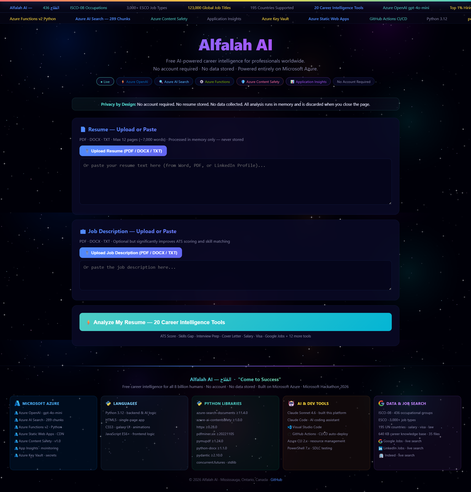

<div align="center">

# Alfalah AI — Career Intelligence Platform

### *الفلاح · "Come to Success"*

**Free AI career guidance for 8 billion people · No account · No data stored · 100% Microsoft Azure**

<br/>

[](https://azure.microsoft.com)
[](https://azure.microsoft.com/products/ai-services/openai-service)
[](https://azure.microsoft.com/products/functions)
[](https://github.com/shahzadms7/v3/actions)

[](https://govrag-v3-func.azurewebsites.net)
[](https://python.org)
[](https://github.com/shahzadms7/v3)

<br/>

[**🌐 Live Platform**](https://govrag-v3-func.azurewebsites.net) &nbsp;·&nbsp;
[**📊 API Health**](https://govrag-v3-func.azurewebsites.net/api/health) &nbsp;·&nbsp;
[**🤖 Responsible AI**](./docs/RESPONSIBLE_AI_IMPACT_ASSESSMENT.md) &nbsp;·&nbsp;
[**🏗️ Architecture**](./ARCHITECTURE.md)

</div>

---

## 📸 Platform Screenshots

### Homepage — Upload Resume & Job Description



> Full-page PDF: [screencapture-govrag-v3-func-azurewebsites-net-2026-03-26-16_24_26.pdf](./docs/screenshots/screencapture-govrag-v3-func-azurewebsites-net-2026-03-26-16_24_26.pdf)

---

## 🎯 Mission

> **Every human being on this planet deserves access to world-class career guidance — not just those who can afford it.**

Alfalah AI (Arabic: *الفلاح* — "success" and "flourishing") delivers **20 AI-powered career intelligence tools** to professionals in all 195 UN-recognized countries. It is completely free, requires no account, retains no data, and runs entirely on Microsoft Azure cloud infrastructure.

**Built for the 8 billion. Not the few.**

---

## 🚀 Live Deployments

| Environment | URL | Status |
|-------------|-----|--------|
| **Platform** (Frontend + API) | https://govrag-v3-func.azurewebsites.net | ✅ Live |
| **API Health Check** | https://govrag-v3-func.azurewebsites.net/api/health | ✅ Live |
| **Source Code** | https://github.com/shahzadms7/v3 | 📂 Public |

---

## ☁️ Azure Architecture

```
┌──────────────────────────────────────────────────────────────────┐
│                      Microsoft Azure — East US                   │
│                                                                  │
│  User Browser                                                    │
│      │                                                           │
│      ▼                                                           │
│  Azure Functions v2  ──►  Azure Content Safety (input screen)   │
│  Python 3.12                      │                             │
│      │                            ▼                             │
│      ├──► Azure AI Search    (289 RAG chunks — semantic search)  │
│      │                            │                             │
│      │         ┌──────────────────┴───────────────────┐         │
│      │         ▼                  ▼                   ▼         │
│      ├──► Azure OpenAI Call 1  Call 2  Call 3  Call 4 (parallel)│
│      │         gpt-4o-mini  ·  4 concurrent AI calls  ·  ~15s   │
│      │                                                           │
│      ├──► Application Insights  (telemetry + error tracking)     │
│      └──► Azure Key Vault       (all secrets — no keys in code)  │
│                                                                  │
└──────────────────────────────────────────────────────────────────┘
```

---

## 🛠️ Azure Services Used

| Azure Service | Tier | Purpose |
|---------------|------|---------|
| **Azure Functions v2** | Consumption (serverless) | API backend — 15 HTTP endpoints, auto-scales to zero |
| **Azure OpenAI** | gpt-4o-mini · eastus | 4 parallel AI calls per analysis — all 20 tools in ~15s |
| **Azure AI Search** | Standard | Semantic search over 289 RAG career knowledge chunks |
| **Azure Content Safety** | Standard v1.0 | Input screening (hate, violence, self-harm) before AI |
| **Azure Static Web Apps** | Free tier · CDN | Frontend global delivery |
| **Application Insights** | Pay-per-use | Real-time telemetry, latency tracking, error alerts |
| **Azure Key Vault** | Standard | API keys and connection strings — zero secrets in code |

**Resource Group:** `rg-v3` &nbsp;·&nbsp; **Region:** East US &nbsp;·&nbsp; **Subscription:** Microsoft Hackathon

---

## 🧠 20 Career Intelligence Tools

All 20 tools execute across **4 parallel Azure OpenAI calls** — total analysis time 10–20 seconds.

| # | Tool | What It Delivers |
|---|------|-----------------|
| 01 | **Resume Score** | ATS score 0–100 across 8 weighted dimensions with detailed breakdown |
| 02 | **Recruiter Perspective** | 6-second hiring manager skim simulation with red flags and quick wins |
| 03 | **Skills Gap Analysis** | Hard/soft skills matched, ATS keywords, certifications + roadmap |
| 04 | **Resume Rewrite** | Diagnosis + impact-first bullets with metrics (%, $, time, team size) |
| 05 | **Cover Letter** | 3-paragraph, role-specific, 3 quantified wins + confident CTA |
| 06 | **Interview Preparation** | 5 full STAR Q&As + strategic questions to ask the interviewer |
| 07 | **STAR Behavioural Stories** | 3 structured stories with metrics for behavioural interviews |
| 08 | **LinkedIn Summary** | Keyword-optimised About section (150–220 words) |
| 09 | **Introduction Scripts** | Word-for-word 1-min / 2-min / 3-min verbal introductions |
| 10 | **Thank You Email** | Post-interview follow-up with subject line and full body |
| 11 | **Salary Negotiation** | Market ranges by level (Entry→VP) + anchor + counter-offer scripts |
| 12 | **30-60-90 Day Plan** | Structured onboarding milestones for first 90 days |
| 13 | **Cold Outreach** | LinkedIn note + DM + cold email + follow-up templates |
| 14 | **Career Pivot Analysis** | Difficulty score + 3 adjacent roles + 90-day transition plan |
| 15 | **Labour Law & Compliance** | Country-specific notice, termination, non-compete, worker rights |
| 16 | **Visa & Immigration** | In-country requirements + all cross-border visa routes + govt URLs |
| 17 | **Matching Jobs & Boards** | Job titles + target companies + regional boards + recruiters |
| 18 | **Similar Occupations** | Adjacent roles from ISCO-08 international classification |
| 19 | **JD Template** | Professional job description for this exact role |
| 20 | **Live Job Openings** | Real-time listings fetched live from Remotive API |

---

## 📡 API Reference

**Base URL:** `https://govrag-v3-func.azurewebsites.net`

| Method | Endpoint | Auth | Description |
|--------|----------|------|-------------|
| `GET` | `/api/health` | None | Platform status, RAG chunk count, Azure service connectivity |
| `POST` | `/career` | None | Full 20-tool career analysis (main endpoint) |
| `POST` | `/upload` | None | Extract text from PDF / DOCX / TXT (in-memory, not stored) |
| `POST` | `/query` | None | Grounded RAG Q&A with source citations |
| `POST` | `/decision` | None | Algorithmic career decision — zero AI cost |
| `POST` | `/search-jobs` | None | Live job listings via Remotive |
| `GET` | `/responsible-ai` | None | Responsible AI principles and data handling statement |

### Example — POST /career

```bash
curl -X POST https://govrag-v3-func.azurewebsites.net/career \
  -H "Content-Type: application/json" \
  -d '{
    "resume": "Your full resume text here...",
    "job_description": "Job description text...",
    "country": "Canada",
    "industry": "IT"
  }'
```

**Response includes:** `naked_truth` (score) · `ats_match` · `cards` (all 20 tools) · `similar_occupations` · `ai_provider` · `metrics` · `privacy`

---

## 📚 Knowledge Base (RAG — 289 Chunks)

| Source | Description | Chunks |
|--------|-------------|--------|
| ISCO-08 | 436 international occupational groups (ILO standard) | ~80 |
| ESCO | 3,000+ European job classifications | ~40 |
| Future Occupations | Emerging roles 2026–2125 | ~30 |
| Country Packages | 195 UN countries — salary, visa, labour law | ~60 |
| Certifications | All-industry certifications A–Z with enroll URLs | ~30 |
| Companies | 500+ top employers by country with career page URLs | ~25 |
| Top-1% Framework | Recruiter science, ATS methodology, interview intelligence | ~10 |
| Global Intelligence | Salary benchmarks, hiring trends, platforms | ~14 |

All files stored as Markdown in `data/career/`. Automatically indexed into Azure AI Search on first request.

---

## 🏗️ Repository Structure

```
shahzadms7/v3/
├── 📄 function_app.py          # Azure Functions v2 — all 15 endpoints
├── 📄 host.json                # Azure Functions config (routePrefix: "")
├── 📄 requirements.txt         # Python dependencies
├── 📄 web.config               # Azure routing rules
│
├── 📁 app/
│   └── core/
│       ├── career_engine.py    # Resume parser + ATS scorer (zero AI cost)
│       ├── decision_engine.py  # Full career decision algorithm
│       ├── ai_provider.py      # Azure OpenAI client (async)
│       ├── rag_engine.py       # Local BM25 search fallback
│       ├── safety_engine.py    # Azure Content Safety wrapper
│       └── config.py           # Centralised settings from env vars
│
├── 📁 data/
│   ├── career/                 # 289 RAG chunks (Markdown files)
│   └── compliance/             # Compliance reference documents
│
├── 📁 static/
│   └── index.html              # Single-page frontend (HTML/CSS/JS)
│
├── 📁 docs/
│   ├── RESPONSIBLE_AI_IMPACT_ASSESSMENT.md
│   ├── TRANSPARENCY_NOTE.md
│   └── screenshots/            # Platform screenshots
│
└── 📁 .github/
    └── workflows/
        └── main_govrag-v3.yml  # CI/CD: GitHub → Azure Functions
```

---

## ⚙️ CI/CD Pipeline

Every push to `main` automatically deploys to Azure Functions.

```
Push to main
    │
    ▼
GitHub Actions
    ├── Setup Python 3.12
    ├── pip install -r requirements.txt
    ├── Azure/functions-action@v1
    │     └── Deploy via publish profile (AZURE_FUNCTIONAPP_PUBLISH_PROFILE secret)
    └── Health check: GET /api/health
```

**Deploy time:** ~2 minutes &nbsp;·&nbsp; **Zero downtime** (serverless swap)

---

## 💻 Local Development

```bash
# Prerequisites: Python 3.12 · Azure Functions Core Tools v4
git clone https://github.com/shahzadms7/v3
cd v3

# Install dependencies
pip install -r requirements.txt

# Configure environment variables
export AZURE_OPENAI_ENDPOINT="https://your-resource.openai.azure.com"
export AZURE_OPENAI_KEY="your-key"
export AZURE_OPENAI_DEPLOYMENT="gpt-4o-mini"
export AZURE_SEARCH_ENDPOINT="https://your-search.search.windows.net"
export AZURE_SEARCH_KEY="your-key"
export AZURE_CONTENT_SAFETY_ENDPOINT="https://your-cs.cognitiveservices.azure.com"
export AZURE_CONTENT_SAFETY_KEY="your-key"

# Start local Azure Functions host
func start

# Test
curl http://localhost:7071/api/health
```

---

## 🔒 Privacy & Responsible AI

| Principle | Implementation |
|-----------|---------------|
| **Zero Storage** | No database. Resume text processed in memory, discarded after response. |
| **Zero PII Retention** | Refresh the page = data is gone. No logs of user content. |
| **Content Safety** | Every input screened by Azure Content Safety before any AI processing. |
| **Transparency** | All AI responses cite RAG sources with relevance scores. |
| **Fairness** | Identical analysis quality for all 195 countries. No demographic data. |
| **Accountability** | Full audit trail via Application Insights (latency, errors — no content). |

Full assessment: [docs/RESPONSIBLE_AI_IMPACT_ASSESSMENT.md](./docs/RESPONSIBLE_AI_IMPACT_ASSESSMENT.md)

---

## 🧰 Full Tech Stack

| Category | Technology | Version | Role |
|----------|-----------|---------|------|
| Cloud | Microsoft Azure | — | 100% infrastructure |
| AI | Azure OpenAI gpt-4o-mini | 2024-08 preview | Career intelligence generation |
| Search | Azure AI Search | 2024-07 API | RAG semantic retrieval |
| Safety | Azure Content Safety | v1.0 | Input moderation |
| Backend | Python | 3.12 | Runtime |
| Framework | Azure Functions | v2 decorator | Serverless API |
| HTTP Client | httpx | ≥0.28.0 | Async Azure OpenAI calls |
| PDF Parsing | pdfminer.six + pymupdf | latest | Resume text extraction |
| DOCX Parsing | python-docx | ≥1.1.0 | Word document extraction |
| Validation | pydantic | ≥2.10.0 | Settings and data models |
| CI/CD | GitHub Actions | — | Auto-deploy on push |
| Dev Assistant | Claude Sonnet 4.6 | — | Built with Claude Code |

---

## 🏆 Hackathon

**Microsoft AI Skills Challenge — Innovation Challenge — March 2026**

Built in 31 sessions from March 6–26, 2026. Submitted March 26, 2026.

---

<div align="center">

*Alfalah AI &nbsp;·&nbsp; Mississauga, Ontario, Canada &nbsp;·&nbsp; Built on Microsoft Azure*

**[GitHub](https://github.com/shahzadms7/v3) &nbsp;·&nbsp; [Live Platform](https://govrag-v3-func.azurewebsites.net) &nbsp;·&nbsp; [Responsible AI](./docs/RESPONSIBLE_AI_IMPACT_ASSESSMENT.md)**

</div>
